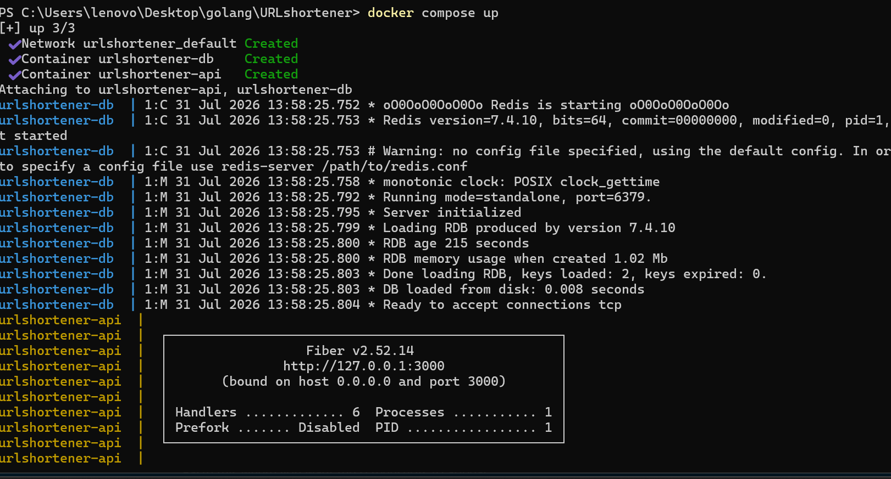
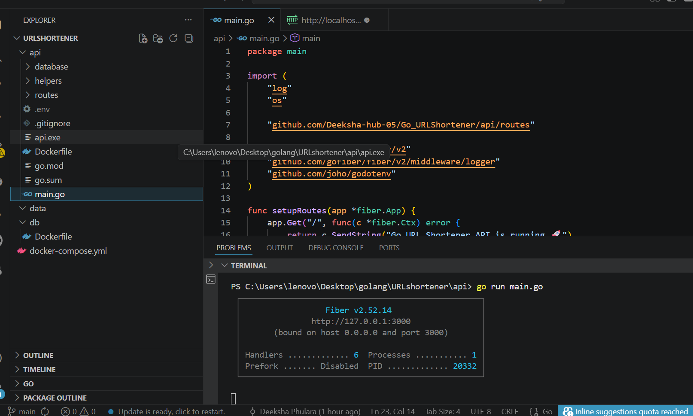
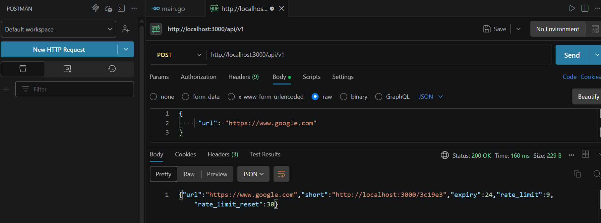

# 🔗 Go URL Shortener

A lightweight and efficient URL Shortener built with **Go**, **Fiber**, and **Redis**. The application enables users to shorten long URLs, create custom aliases, redirect to original URLs, and protects the service with Redis-based rate limiting. The entire application is containerized using **Docker** and **Docker Compose**.

---

## 📌 Project Overview

This project demonstrates backend development using Go by implementing a scalable URL shortening service. The application stores URL mappings in Redis, validates URLs before shortening, prevents abuse using Redis-based rate limiting, and supports Docker-based deployment for consistent development and production environments.

---

## 🚀 Features

- 🔗 Shorten long URLs
- ✨ Custom short URL support
- 🔄 Redirect short URLs to original URLs
- ✅ URL validation
- 🔒 HTTPS enforcement
- 🚫 Domain blocking
- ⏳ Configurable URL expiration
- 🚦 Redis-based rate limiting
- 🐳 Dockerized deployment
- ⚙️ Environment variable configuration using `.env`

---

## 🛠 Tech Stack

| Technology | Purpose |
|------------|---------|
| **Go** | Backend Language |
| **Fiber** | Web Framework |
| **Redis** | Database & Rate Limiting |
| **Docker** | Containerization |
| **Docker Compose** | Multi-container orchestration |
| **govalidator** | URL Validation |
| **google/uuid** | Short Code Generation |
| **godotenv** | Environment Variable Management |

---

## 📁 Project Structure

```text
Go_URLShortener/
│
├── assets/
│   ├── docker.png
│   ├── redis.png
│   └── postman.png
│
├── api/
│   ├── database/
│   ├── helpers/
│   ├── routes/
│   ├── Dockerfile
│   ├── go.mod
│   ├── go.sum
│   ├── main.go
│   └── .env
│
├── db/
│   └── Dockerfile
│
├── docker-compose.yml
├── README.md
└── .gitignore
```

---

## ⚙️ Environment Variables

Create a `.env` file inside the **api** folder.


---

## 📋 Prerequisites

Before running the application, install:

- Go 1.22+
- Redis
- Docker
- Docker Compose
- Git

---

# 🐳 Run with Docker

Clone the repository:

```bash
git clone https://github.com/Deeksha-hub-05/Go_URLShortener.git
```

Navigate to the project directory:

```bash
cd Go_URLShortener
```

Build and start the containers:

```bash
docker compose up --build
```

The application will be available at:

```
http://localhost:3000
```

Stop the containers:

```bash
docker compose down
```

---

# 💻 Run Locally

Navigate to the API folder:

```bash
cd api
```

Install dependencies:

```bash
go mod tidy
```

Run the application:

```bash
go run main.go
```

> **Note:** Ensure Redis is running before starting the application.

---

## 🔄 Application Workflow

```text
Client
   │
   ▼
POST /api/v1
   │
   ▼
Validate URL
   │
   ▼
Generate Short Code
   │
   ▼
Store URL Mapping in Redis
   │
   ▼
Return Short URL
```

---

# 📌 API Endpoints

## 1️⃣ Shorten URL

**POST**

```
/api/v1
```

### Request

```json
{
    "url": "https://www.google.com"
}
```

### Sample Response

```json
{
    "url": "https://www.google.com",
    "short": "http://localhost:3000/abc123",
    "expiry": 24,
    "rate_limit": 9,
    "rate_limit_reset": 30
}
```

---

## 2️⃣ Redirect

**GET**

```
/{shortCode}
```

Example:

```
http://localhost:3000/abc123
```

Redirects to the original URL.

---

# 📦 Useful Docker Commands

Build containers:

```bash
docker compose build
```

Start containers:

```bash
docker compose up
```

Rebuild and start:

```bash
docker compose up --build
```

Stop containers:

```bash
docker compose down
```

View running containers:

```bash
docker ps
```

---

# 📸 Screenshots

## 🐳 Docker



---

## 🚀 Fiber Server



---

## 📬 Postman



---

# 🧪 Example

Create a short URL:

```bash
curl -X POST http://localhost:3000/api/v1 \
-H "Content-Type: application/json" \
-d "{\"url\":\"https://www.google.com\"}"
```

Open the generated short URL:

```
http://localhost:3000/abc123
```

You will be redirected to the original URL.

---

# 🎯 Future Improvements

- User authentication
- Click analytics dashboard
- QR code generation
- Custom alias management
- Swagger/OpenAPI documentation
- Unit and integration tests
- CI/CD using GitHub Actions
- Kubernetes deployment
- Redis Cluster support

---

# 🤝 Contributing

Contributions are welcome!

1. Fork the repository.
2. Create a feature branch.
3. Commit your changes.
4. Push your branch.
5. Open a Pull Request.

---

# 👩‍💻 Author

**Deeksha**

- GitHub: https://github.com/Deeksha-hub-05
- Project: https://github.com/Deeksha-hub-05/Go_URLShortener

---

⭐ **If you found this project helpful, consider giving it a star on GitHub!**
